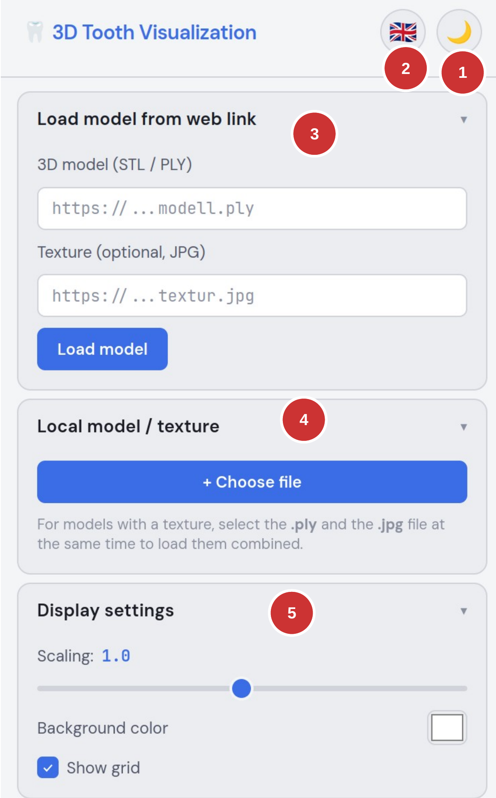
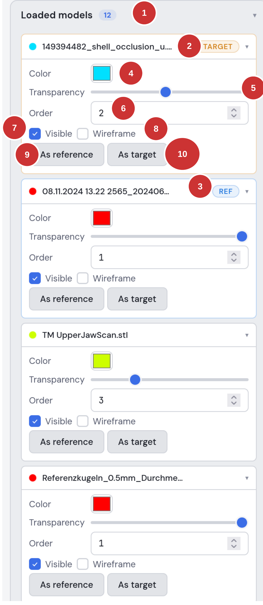
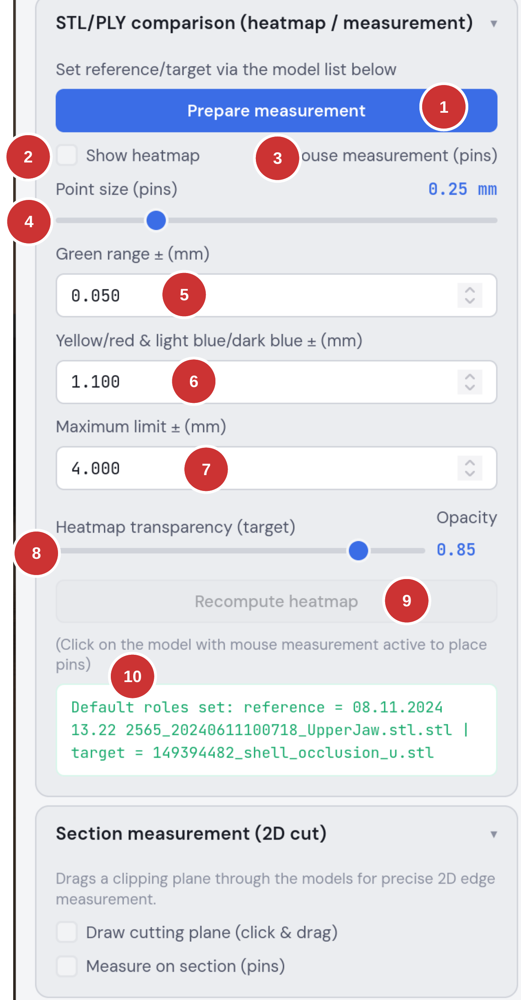
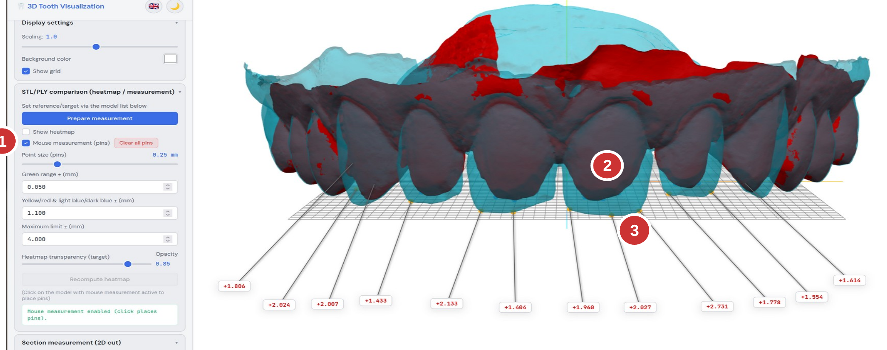
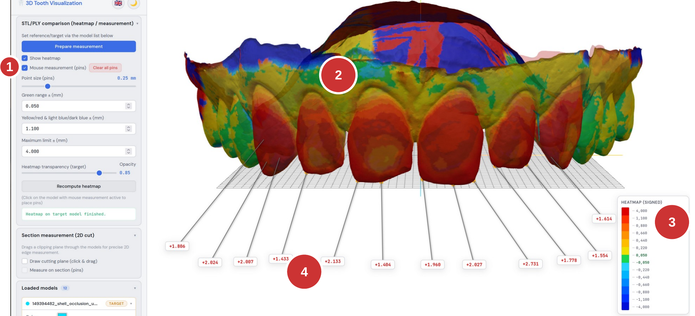
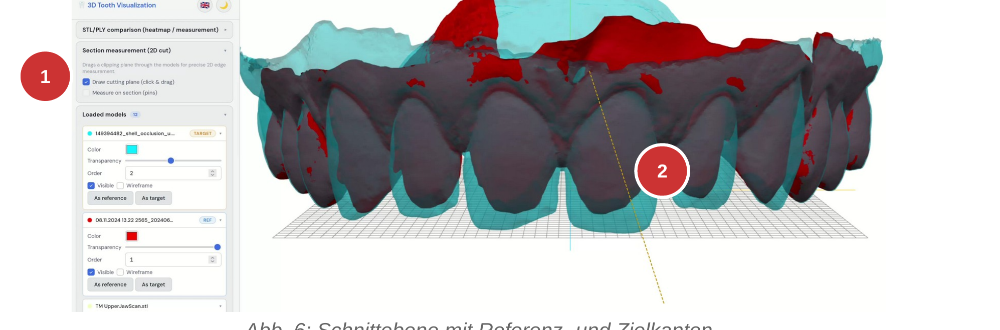
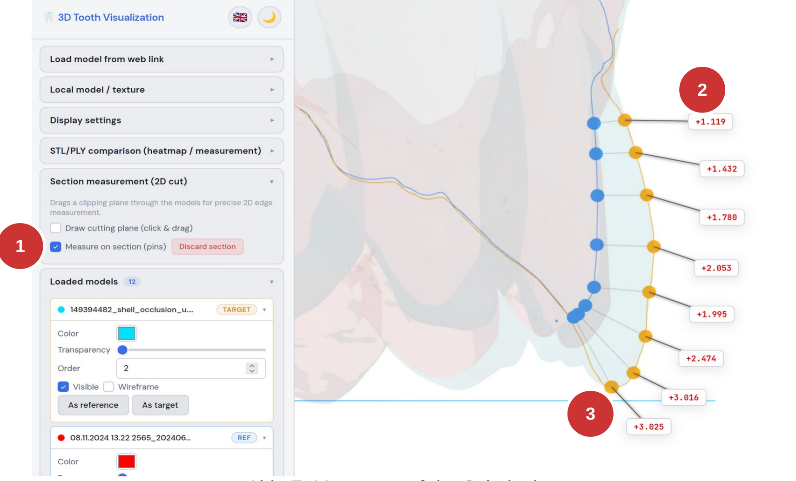
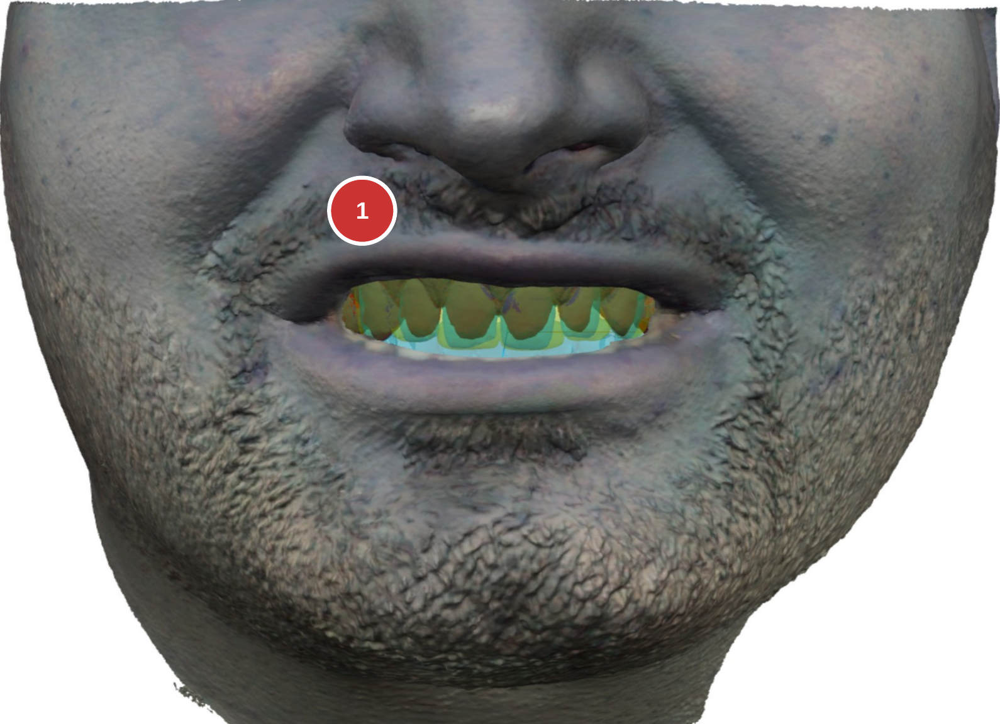

# 3D Tooth Visualization — User Manual

Web application for STL/PLY model analysis, heatmap comparison, and distance measurement.

This document describes how to operate the **3D Tooth Visualization** web application.
The application loads, displays, and precisely measures 3D tooth models in STL and PLY format
directly in the web browser — no installation required.

> Created in the context of an independent procedure for the taking of evidence
> ("selbständiges Beweisverfahren"). This manual is technical operating documentation only.

---

## Table of contents

1. [Overview](#1-overview)
2. [User interface](#2-user-interface)
3. [Managing loaded models](#3-managing-loaded-models)
4. [STL/PLY comparison — settings](#4-stlply-comparison--settings)
5. [Mouse measurement (pins)](#5-mouse-measurement-pins)
6. [Heatmap display](#6-heatmap-display)
7. [Section measurement (2D cut)](#7-section-measurement-2d-cut)
8. [Face scan display](#8-face-scan-display)
9. [Quick guide: performing a measurement](#9-quick-guide-performing-a-measurement)

---

## 1. Overview

The "3D Tooth Visualization" web application makes it possible to load, display, and precisely
measure 3D tooth models in STL and PLY format directly in the web browser without installation.

**Core features**

- Loading 3D models (STL/PLY) via URL or local file
- Comparing two models with a color-coded heatmap (deviation display)
- Point-precise distance measurement by mouse click (pins) in millimeters
- Section measurement: a 2D cutting plane through the models with edge measurement
- Display of a textured face scan (PLY + texture) for visualization
- Switchable light/dark mode

---

## 2. User interface

The application consists of a sidebar (left) containing all settings and the 3D viewer (right).
The sidebar is divided into collapsible sections.

*Fig. 1: Sidebar — upper section*

1. **Title and theme toggle** — the moon/sun icon switches between light and dark design.
2. **Language selection** — a total of 84 languages.
3. **Load model from web link** — load 3D models (STL/PLY) and optional textures (JPG) via a URL.
4. **Local model / texture** — select files from your own computer. For textured models, select the `.ply` and `.jpg` files at the same time.
5. **Display settings** — configure scaling, background color, and grid display.

---

## 3. Managing loaded models

The "Loaded models" section lists all currently loaded 3D models. Each model can be configured
individually.

*Fig. 2: Model list with settings*

1. **Model heading with counter badge** — shows the total number of loaded models.
2. **TARGET badge** — this model is set as the target model for the comparison (the model that is measured).
3. **REF badge** — this model is set as the reference model (the baseline for the distance measurement).
4. **Color** — change the model's individual color.
5. **Transparency** — set the model's opacity (useful for overlapping models).
6. **Order** — the number defines which models may overlap others in the display order.
7. **Visible** — show or hide the model in the display.
8. **Wireframe** — display the model as a wireframe.
9. **"As reference"** — set the model as the reference for the comparison.
10. **"As target"** — set the model as the target for the comparison.

> **Important:** For all comparison functions (heatmap, measurement, section), a reference model and
> a target model must first be defined. The reference model serves as the baseline; the target model
> is measured against it.

---

## 4. STL/PLY comparison — settings

The "STL/PLY comparison (heatmap / measurement)" section contains all settings for the distance
analysis.

*Fig. 3: Comparison settings*

1. **"Prepare measurement"** — computes the spatial data structures (BVH) for fast distance calculation. Must be run once before each measurement.
2. **"Show heatmap"** — activates the color-coded deviation display on the target model.
3. **"Mouse measurement (pins)"** — activates interactive measurement. Hovering over the model with the mouse shows the distance to the reference model. Clicking places a measurement point (pin).
4. **Point size (pins)** — sets the point size in mm for the mouse measurements.
5. **Green range ± (mm)** — the tolerance range displayed as "green" (= acceptable deviation). Default: 0.050 mm.
6. **Yellow/red & light blue/dark blue ± (mm)** — threshold for the transition between color levels. Default: 1.100 mm.
7. **Maximum limit ± (mm)** — the upper bound of the color scale. Deviations beyond it are shown in dark red or dark blue. Default: 4.000 mm.
8. **Heatmap transparency** — controls the opacity of the heatmap display on the target model.
9. **"Recompute heatmap"** — recomputes the heatmap with changed threshold values.
10. **Status display** — shows the current state (e.g. whether roles are set, calculation running, etc.).

---

## 5. Mouse measurement (pins)

The mouse measurement makes it possible to measure the distance between the reference and target
model at any location and to fix it as a pin.

*Fig. 4: Mouse measurement with placed pins*

1. The **"Mouse measurement (pins)"** checkbox must be activated.
2. When hovering over the target model with the mouse, the current distance value is shown in mm. Clicking places a pin that remains permanently visible.
3. **Orange points** = position on the target model; **blue points** = nearest point on the reference model. The connecting line shows the measurement direction.

Pins can be moved by drag and drop (only the label moves; the 3D points remain). "Clear all pins"
removes all measurement points.

---

## 6. Heatmap display

The heatmap colors the target model according to its deviation from the reference model. The colors
range from dark blue (negative deviation / material missing) through green (within tolerance) to
dark red (positive deviation / excess material).

*Fig. 5: Heatmap with legend and measurement pins*

1. The **"Show heatmap"** checkbox is activated — the calculation runs automatically.
2. The color display on the model shows the spatial deviation. Red/orange = excess material (target is thicker than reference); blue = missing material (target is thinner than reference); green = within tolerance.
3. The legend at the bottom right maps the colors to the millimeter values. The signed display shows both the direction and the magnitude of the deviation.
4. Existing pins remain visible while the heatmap is active and continue to show the exact measured values.

**Heatmap color interpretation (signed)**

- **Dark red (+4.000 mm):** strong positive deviation — target model is clearly outside.
- **Orange/yellow (+0.220 to +1.100 mm):** moderate positive deviation.
- **Green (±0.050 mm):** within tolerance.
- **Light blue (-0.220 to -1.100 mm):** moderate negative deviation.
- **Dark blue (-4.000 mm):** strong negative deviation — material missing.

---

## 7. Section measurement (2D cut)

The section measurement makes it possible to place a cutting plane through the models and to perform
exact 2D edge measurements on that plane.

*Fig. 6: Cutting plane with reference and target edges*

1. Activate **"Draw cutting plane"**, then drag a line in the 3D viewer with click and drag. The cutting plane is computed automatically.
2. **Blue line** = section edge of the reference model; **orange line** = section edge of the target model. The camera automatically pivots to the cutting plane.

*Fig. 7: Measurement on the cutting plane*

1. Activate **"Measure on section (pins)"** to measure on the cutting plane.
2. The measured values show the distance between the target and reference edge in millimeters, color-coded according to the heatmap scale.
3. **Orange points** = target edge; **blue points** = reference edge.

---

## 8. Face scan display

The application can also load textured PLY models, such as a face scan. This is displayed with its
associated photo texture and allows the tooth models to be placed in a facial context.

*Fig. 8: Textured face scan with overlaid tooth models*

1. The tooth models (STL/PLY) are displayed positioned within the face scan. This allows an assessment of the overall aesthetic effect.

---

## 9. Quick guide: performing a measurement

The following steps are required to perform a distance measurement between two models.

1. Open the web page.
2. Wait until all models have loaded (status at the bottom of the sidebar).
3. In the "Loaded models" section: set one model as "reference" and another as "target".
4. In the "STL/PLY comparison" section: click "Prepare measurement".
5. Activate "Mouse measurement (pins)" — distances are now shown when hovering over the target model.
6. Click on the model to place measurement points (pins).
7. Optional: activate "Show heatmap" for an area-wide deviation display.
8. Optional: use the section measurement for exact 2D cut measurements.

**Keyboard shortcuts**

- **ESC** — deactivate mouse measurement and cutting-plane drawing
- **Mouse wheel** — zoom
- **Left mouse button + drag** — rotate the model
- **Right mouse button + drag** — pan the model

**Note on the measurement method**

For each point on the target model, the application computes the shortest distance to the reference
model. Measured values are given in millimeters (mm). Positive values (red) mean that the target
model lies above the reference model (excess material / the target is thicker). Negative values
(blue) mean that the target model lies below the reference model (material missing / the target is
thinner).
